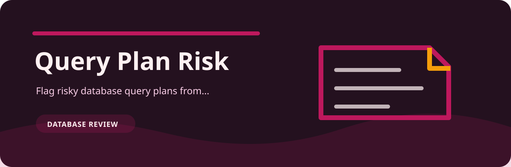
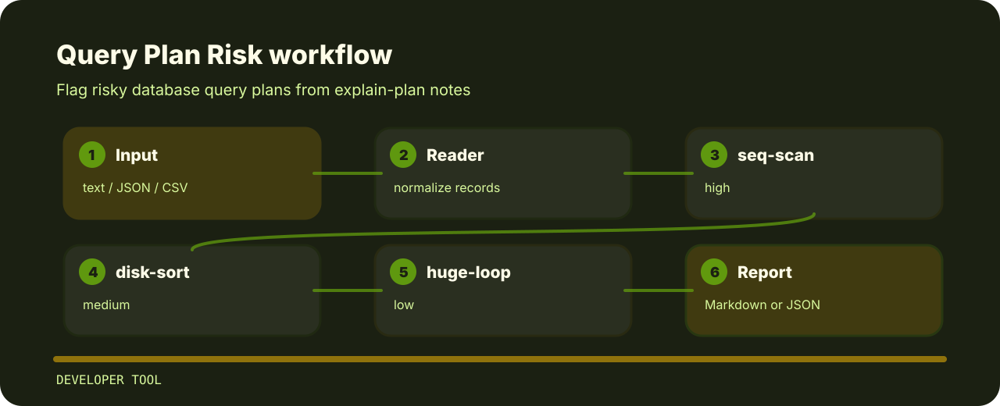

# Query Plan Risk

Flag risky database query plans from explain-plan notes.



## Finding map



## What it protects

- Targets database review instead of broad linting.
- Accepts plain text and returns terminal findings, optional json.
- Keeps each rule visible so the project can be tuned without hunting through prose.

## Signals

- `seq-scan` - sequential scan detected (high); review indexes and predicates.
- `disk-sort` - disk sort detected (medium); add index or raise work memory intentionally.
- `huge-loop` - large nested loop detected (low); check join order and cardinality.

## Command path

```bash
git clone https://github.com/mertefekurt/query-plan-risk.git
cd query-plan-risk
python -m pip install -e ".[dev]"
query-plan-risk examples/sample.txt
```
